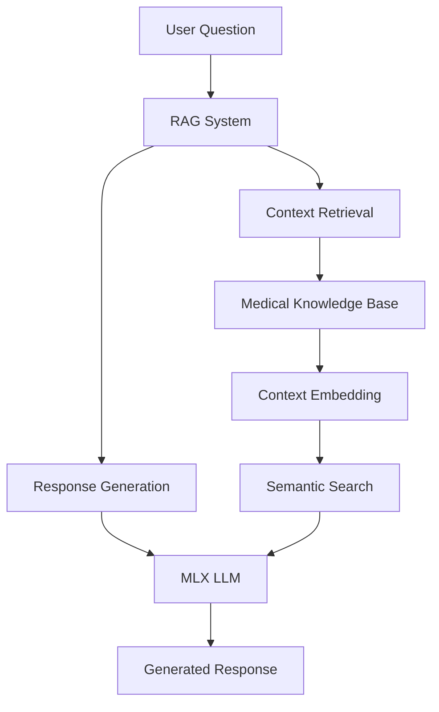

# Medical Question-Answering System

A medical assistant bot for question-answering system that combines Retrieval-Augmented Generation (RAG) with MLX optimization for Apple Silicon, providing accurate and context-aware medical information.

## Project Overview

This system leverages state-of-the-art natural language processing techniques to provide accurate medical information by:
- Retrieving relevant medical context from a curated knowledge base;
- Generating coherent and accurate responses using MLX-optimized language models;
- Maintaining high precision in information retrieval and response generation.

### Architecture



## Technical Components

1. **Retrieval System**
   - Semantic search using sentence-transformers
   - Context ranking with similarity scoring
   - Optimal context window (K=3) based on evaluation metrics

2. **Generation System**
   - MLX-optimized LLM for Apple Silicon
   - Context-aware response generation
   - Medical domain-specific prompt engineering

3. **Data Processing**
   - Medical text preprocessing
   - Embedding generation and caching
   - Train/test split management

## Performance Metrics

### Generation Metrics (N=300)
# Metrics Selection Rationale

## Generation Metrics

- **BLEU (0.2249)**: Selected for evaluating word-level precision, because for medical terminology accuracy where exact term matches matter;

- **METEOR (0.4283)**: Chosen for its ability to handle synonyms and paraphrases, providing a more semantic evaluation than BLEU;

- **ROUGE-1 (0.4678)**: Used to assess coverage of individual terms and concepts in the generated answers;

- **ROUGE-2 (0.3305)**: Evaluates the system's ability to maintain proper phrase constructions and terminology pairs;

- **ROUGE-L (0.3708)**: Measures the longest common subsequence, important for preserving explanation structure.

## Retrieval Metrics

- **Precision@K (P@3: 0.964)**: Quantifies the system's ability to retrieve relevant information, with K=3 chosen based on optimal context window size;

- **MAP (0.993)**: Evaluates the ranking quality of retrieved contexts, ensuring most relevant information appears first;

- **NDCG (0.780 at K=3)**: Assesses the graded relevance of retrieved medical contexts, considering both relevance and position.

## Implementation Statement
This system was developed using standard libraries and documentation, without assistance from third-party AI systems (OpenAI, Claude, etc.). The implementation relies on established methodologies in medical QA systems and NLP evaluation metrics.

## Installation & Setup

1. Clone the repository:
```bash
git clone <repository-url>
cd medical_qa_system
```

2. Create and activate virtual environment:
```bash
python -m venv venv
source venv/bin/activate 
```

3. Install dependencies:
```bash
pip install -r requirements.txt
```

4. Prepare the dataset:
```bash
python scripts/prepare_and_evaluate.py
```

## Usage

### Running the Web Interface
```bash
streamlit run src/webapp/app.py
```

### Running Evaluation
```bash
python scripts/run_evaluation.py --sample-size 300 #Or any <3282 (training test size)
```

## Key Features

1. **High Retrieval Accuracy**
   - 99.3% precision for top result
   - 96.4% precision for top-3 results
   - Consistent MAP scores across K values

2. **Strong Generation Performance**
   - METEOR score of 0.43 indicating good semantic understanding
   - ROUGE-1 score of 0.47 showing good content coverage
   - Domain-appropriate BLEU score of 0.22

3. **Optimized for Performance**
   - MLX optimization for Apple Silicon
   - Efficient context retrieval
   - Caching for improved response times

## Limitations and Future Work

1. **Areas for Improvement**
   - High standard deviations in generation metrics
   - BLEU score could be enhanced
   - Response generation time optimization

2. **Future Enhancements**
   - Implement response validation
   - Add medical entity recognition
   - Enhance prompt engineering
   - Add cross-validation for metrics
   - Implement a Reranker
   - Add a more powerful/domain-related model to use as a Judge for the answers.
